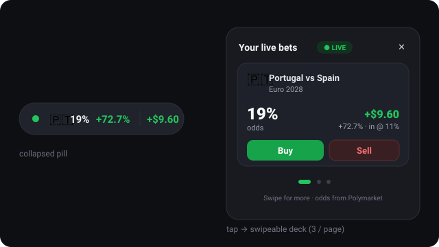

# BetJet 🎯

A Chrome extension (Manifest V3) with a **floating widget** — like the Rabby wallet
perp-trades widget — that surfaces your **Polymarket sports bets on matches that are
live right now**, and lets you **buy/sell odds with one swipe**.



## What it does

- **Frosted-glass UI**: small translucent pill and panel with backdrop blur — deliberately
  subtle on top of any page.
- **$BETJET token gate**: the tools unlock only while the user's Solana (Privy) wallet holds
  **≥ $1 of the $BETJET pump.fun token**, valued live (Solana RPC balance × DexScreener/Jupiter
  price). Locked users see a Buy button ("buy and hold at least $1 worth $BETJET to use the
  tools"). See `src/lib/tokengate.ts` — set the real mint address there.

- **Collapsed pill** (bottom-right, every page): if you have a bet on a live match it shows
  the country **flag (no text) + current odds + PnL%**, colored **green for profit, red for
  loss**, plus your aggregate PnL — exactly the Rabby-style compact readout.
- **Tap to expand**: a panel shows **all your predictions on the live match**. It’s a
  **swipe deck — ~3 predictions per page**, swipe (or dots/arrows) for more, and **Buy/Sell**
  on any of them.
- **Live-only**: nothing shows for upcoming or finished matches. A bet only appears once its
  match is judged **in-play**.
- **Discover fallback**: if **none** of your betted matches is live, the widget shows
  predictions from **currently-live markets** so you can place a bet.

## How the pieces map to your questions

> **"Polymarket public API + Privy wallet — yeah?"** → **Yes.**
> - Read odds/markets from the **Gamma API** (`gamma-api.polymarket.com`, no auth) — `src/lib/polymarket.ts`.
> - A bet is an **EIP-712 signed order** posted to the **CLOB** (`clob.polymarket.com`),
>   settled in **USDC on Polygon**. A **Privy embedded wallet** signs those orders.
>   The signing/posting is behind the `Trader` interface in `src/lib/trade.ts`.

> **"Or connect to their MAIN Polymarket wallet and bet from there?"** → **Basically no.**
> Polymarket funds live behind a **proxy/smart wallet** (Magic for email users, a Safe-style
> proxy for wallet users). There is **no OAuth "connect my Polymarket account"** — you can’t
> reach into someone’s existing Polymarket balance/positions and trade unless you control
> their signer. Practical options: **(a) a dedicated Privy embedded wallet** (recommended),
> or **(b) connect an external EOA** (MetaMask/WalletConnect). Both are behind the `Wallet`
> interface in `src/lib/wallet.ts`.

> **"Cross-check my bets and show only the ones whose match is live"** → `src/lib/snapshot.ts`
> joins your positions (`data-api.polymarket.com/positions?user=<addr>`) with live matches and
> computes PnL. **Live detection** is `src/lib/live.ts` (start-time heuristic today; swap in a
> scores API for true in-play).

## Architecture

```
manifest.config.ts        MV3 manifest (crxjs)
src/
  content/index.tsx       injects the widget into a Shadow DOM (no CSS bleed)
  content/styles.ts       all widget CSS
  background/index.ts      service worker: polls + caches the snapshot (chrome.alarms)
  popup/                   toolbar popup: connect wallet + explainer
  components/              Widget, CollapsedPill, SwipeDeck, PredictionCard, Flag, Gate
  lib/
    tokengate.ts           $BETJET gate: Solana balance x live pump.fun price
    kv.ts                  chrome.storage-backed key-value helper
    polymarket.ts          Gamma markets + data-API positions (read)
    live.ts                LiveSource interface + start-time heuristic
    snapshot.ts            cross-check bets × live matches → WidgetSnapshot
    data.ts                orchestrator with mock fallback + cache
    bets.ts                user bets store (chrome.storage.local)
    wallet.ts              Wallet interface + demo/Privy-ready stub
    trade.ts               Trader interface + mock CLOB order flow
    flags.ts, format.ts    country→flag, odds/PnL formatting
    mock.ts                demo matches + bets so the UI always renders
```

## Run it

```bash
npm install
npm run build          # type-checks + builds to dist/
# Chrome → chrome://extensions → Developer mode → "Load unpacked" → select dist/
npm run dev            # HMR dev build (crxjs)
```

Open any page: the widget appears bottom-right. With no network/wallet it renders **demo**
data (Portugal @ 11% → live at 19%, in profit) so you can see the full flow.

## What’s real vs. stubbed in this MVP

| Area | Status |
| --- | --- |
| Live odds / markets (Gamma) | **Real** API client, with mock fallback |
| Positions read (data API) | **Real** client (needs a wallet address) |
| $BETJET gate (balance × price) | **Real** clients (Solana RPC + DexScreener/Jupiter); demo mode until the real mint is set |
| Live detection | **Heuristic** (start-time); pluggable `LiveSource` for a scores API |
| Wallet | **Demo** stub behind `Wallet`; drop in Privy (EVM + Solana embedded wallets) |
| Buy/Sell (CLOB orders) | **Mocked** behind `Trader`; full swipe/buy/sell UX works |

### Going live (to place real bets)
1. Set the real `$BETJET` mint address in `src/lib/tokengate.ts`.
2. Implement `Wallet` with Privy (`@privy-io/react-auth`): create the embedded wallets
   (EVM for CLOB orders, Solana for $BETJET), expose addresses, sign EIP-712.
3. Implement `Trader` with `@polymarket/clob-client`: set USDC allowances, build + sign the
   order, POST to `/order`.
4. Optionally implement a scores-API-backed `LiveSource` for accurate in-play status.

The UI and data layer don’t change — only those interfaces get real backings.

## Funding: how users get USDC on Polygon (and the Bitcoin question)

- **Privy** supports **EVM + Solana embedded wallets** (both used here) and card **onramps**
  (MoonPay/Coinbase-style funding built into their SDK). Privy also has on-chain **Bitcoin**
  wallet support — but **not Lightning**. Verify current support in Privy's docs before
  building on it.
- **Polymarket** settles everything in **USDC on Polygon**; its deposit UI additionally
  accepts BTC/ETH/SOL-style deposits by auto-converting through cross-chain routing partners.
  Those routes belong to polymarket.com — third parties can't reuse them.
- **For BetJet users** the practical funding paths are:
  1. **Card onramp → USDC (Polygon)** directly into the Privy wallet (simplest),
  2. **Send any token** to the Privy wallet, then swap/bridge to Polygon USDC via a bridge
     aggregator API (LI.FI, Relay, deBridge) inside the extension,
  3. **Bitcoin**: on-chain BTC → a swap service → Polygon USDC. **Lightning specifically
     would need a third-party Lightning⇄on-chain service (e.g. Boltz-style submarine swaps)**
     since Privy doesn't speak Lightning — doable, but adds real complexity; treat it as a
     later phase.

## Deploying

See **[docs/DEPLOYMENT.md](./docs/DEPLOYMENT.md)**. Short version: the extension ships via
the **Chrome Web Store** ($5 one-time dev fee, zip the `dist/` folder, justify permissions).
**Vercel is not where extensions go** — use it only for the optional companion pieces
(landing page + privacy policy, key-hiding API proxy, scores service, agent backend).

## Roadmap: BetJet as a full sports-betting agent

The architecture already separates data (snapshot) from actions (`Trader`), so agent
features layer on cleanly:

- **Alerts**: odds moves / PnL thresholds on your live bets (extension notifications).
- **Auto cash-out rules**: user-set stop-loss / take-profit executed via `Trader`.
- **Limit orders**: rest orders on the CLOB book instead of market-taking.
- **Copy betting**: follow profitable wallets (data-API positions are public per address).
- **AI picks**: an agent backend (Claude API) that analyzes markets + live scores and
  drafts bets for one-tap confirmation — never auto-firing without user confirmation.
- **Live scores overlay** in the widget (same scores API as `LiveSource`).
- **$BETJET tiers**: hold more → more tools (higher alert limits, agent picks, etc.).
